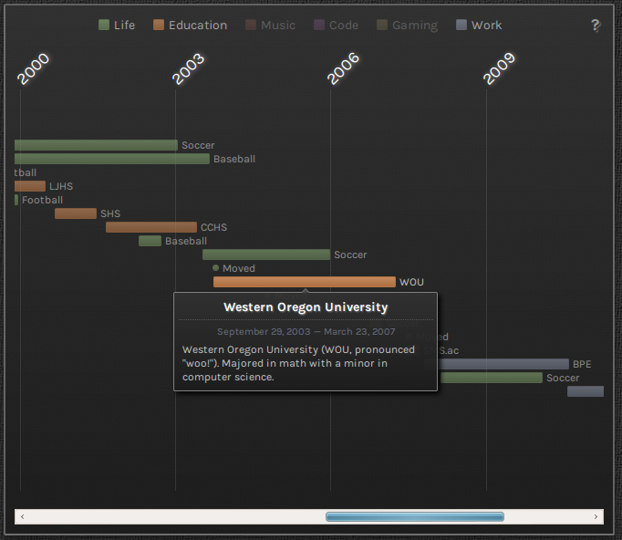
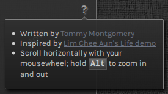

# Eventline

This is a thing. It's inspired by [this demo](https://github.com/cheeaun/life).
Here's a pretty picture. You can also view it in action on [my website](http://tmont.com/about/eventline).



It's licensed under the [WTFPL](http://www.wtfpl.net/about/) if you care about that kind
of stuff.

## Installation
Reference `jquery.eventline.js` somewhere. You will also need the following scripts included as well:

* jQuery
* `lib/jquery.mousewheel.js`
* `lib/date.format.js`

I probably could have alleviated the need for `dateFormat`, but in my case I was already
including it, so it didn't hurt. I would gladly accept pull requests that would remove this
dependency. That would be awesome.

You will also need to reference the CSS contained in `eventline.css` as well. And you'll need
to make some additions to get the colors to look nice and stuff. Look at the stuff in the
`example/` directory for inspiration. It's pretty simple.

## Browser Support
- Chrome
- Firefox

I didn't test on anything else because I don't hate myself enough. Probably kinda works
on IE10+. It uses `[].forEach` and `[].map` and stuff and I can't remember which version
of IE actually supports those.

The CSS uses gradients and I didn't include the MS filter garbage to make those work.
I would also gladly accept pull requests for those.

## Usage
Once you've included all the relevant stuff, do this:

```javascript
var events = [
	{
		abbreviation: 'Robbery',
		title: 'My career as a jewel thief was short lived',
		description: 'Would have gotten away with it if it wasn\'t for the security cameras.',
		category: 'Jailtime',
		startDate: new Date('1998-06-01'),
		endDate: new Date('1998-09-01')
	},

	{
		abbreviation: 'Arson',
		title: 'It was an accident!',
		description: 'They really should put a warning on the box: "DO NOT THROW AWAY LIT CIGARETTES IN A PAPER FACTORY". Merry Christmas to your face, judge.',
		category: 'Jailtime',
		startDate: new Date('1998-12-25'),
		endDate: new Date('1999-02-14')
	}
];

$('#my-awesome-selector-full-of-events').eventline({ events: events });
```

To kill it, do this:

```javascript
$('#my-awesome-selector-full-of-events').eventline('destroy');
```

### Options
#### `events`
`events` is an array of objects that look like this:

```javascript
{
	// required: a short version of the title
	abbreviation: 'Short',
	// required: the longer title
    title: 'Longer Title',
    // required: description of the event
    description: 'Such description. Wow. Very text.',
    // required: events are grouped into categories. this should be a single word.
    category: 'Jailtime',
    // required: the date the event started (up to hour resolution is supported)
    startDate: new Date('1998-12-25'),
    // optional: the date the event ended. for ongoing events, set to null
    endDate: new Date('1999-02-14'),
    // optional: set to true for events that are just a moment in time, like a wedding
    // note that endDate is ignored if moment is true
    moment: false
}
```

#### `widthPerUnit`
`widthPerUnit` (default = `150`) is the width of the time units used to construct
the axis. I can't make it any clearer than that.

#### `defaultCategories`
`defaultCategories` is an array of categories that should be shown by default. If
this isn't set (or set to an empty array) then all categories are shown by default.

#### `showCredits`
`showCredits` (default = `true`) shows a little question mark in the top right corner with links to
me (the author), and the guy who inspired me to create this (Lim Chee Aun), plus
a tip on how to use the mousewheel to maximum advantage. It looks like this:



## Example
Do this:

```bash
git clone git@github.com:tmont/eventline.git
cd eventline
npm install
npm start
```

And then go to `http://localhost:12345/example/` in your browser and feast your eyes.